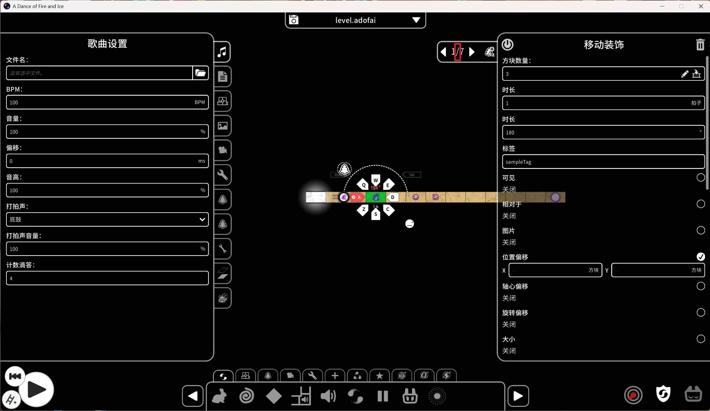

English | [简体中文](README.md)

# ADOFAI Editor Extension

A Unity Mod Manager mod for the official *A Dance of Fire and Ice* level editor: a **grouped decoration list**, plus a **pager jump-to-event popup** with multi-select and batch editing.

## Features

### Grouped decoration list

The decoration list on the left is grouped automatically by type / `tag` / custom rules, so you no longer have to hunt through hundreds of flat rows.

- **Automatic grouping**: group by decoration type or by `tag`. A small "grouping mode" button in the panel's bottom toolbar cycles through
  No grouping → By type → By tag → Custom (the same option exists in the mod settings page as the default).
- **Custom groups**: name a group and bind it to one or more `tag`s in the settings page, or **drag a decoration row straight onto a group** to assign it. Sorting works both inside a group and across groups.
- **Multi-select batch drag**: while several rows are selected (`ctrl` to add one at a time, `shift` for a range), dragging any one of them moves the whole selection to the drop target while **preserving relative order**; dropping onto a group header appends to that group's end. A `×N` badge follows the dragged rows.
- **Group header controls**: each group header row is split into four parts `[arrow] [group name (count)] [eye] [lock]` —
  the arrow collapses/expands; clicking the name selects the whole group and opens the vanilla multi-select property panel on the right (changing one property applies it to every decoration in the group); the eye/lock toggles visibility and locking for the entire group (the same APIs as the vanilla per-row buttons — no separate state is invented).
- **Group header color**: every custom group row in the settings page has a vanilla RGBA color control (default transparent = no tint). The header background is tinted accordingly, and the name / count / triangle / eye / lock automatically pick a contrasting color (black on light backgrounds, the original color on dark ones). Colors are stored in `Settings.json` together with the groups; the decoration and event group sets are independent of each other.
- **Optional write-back to the level file**: manual assignments can live only in the current session, or be written into the level file (decoration key `aeeGroupDeco`, event key `aeeGroupEvent`). Off by default — see [Caveats and level compatibility](#caveats-and-level-compatibility).

### Pager jump-to-event popup

Click the slash in the pager to open the event list.

Events of the same type at the same position are stacked by the vanilla editor into a `◀ 1/3 ▶` pager that you can only step through one at a time. **Click the pager text itself** to open a scrollable jump list instead (the vanilla prev/next arrows still work as before).

- **Click a row to jump**: jumps to that event (via `tab.eventIndex` + `ShowPanel`, without forcing `selectedEvent`), and the popup stays open so you can keep clicking — a direct replacement for the prev/next arrows.
- **Automatic grouping by `tag` / `eventTag`**: headers collapse and expand; clicking a header name selects the entire group, and rows can be dragged onto a group to reassign them.
- **Multi-select**: `ctrl` adds/removes one row at a time; `shift` selects a range from an anchor (repeated `shift` over the same span grows or shrinks it); clicking a group name selects the whole group.
- **Batch editing**: with a multi-selection active, the property panel on the right switches to batch mode and any value you change is written to every selected event.
  Fields whose values **differ** across the selection are highlighted in red as `(Mixed)` and **remain editable** — typing a new value applies it to all of them.
  The batch view stays active after closing the popup, so it still applies when you reopen it.
- **Copy / cut / paste inside the popup**: `ctrl-shift-c/x`, `ctrl-alt-c/x` and `ctrl-shift-v` operate on events with vanilla semantics (single selection = the current event, multi-selection = all selected events), and a toast in the top-left reports "copied N / cut N / pasted N".
  The vanilla editor disables all shortcuts while a popup is open, so the mod takes these over.
- **Undo / redo inside the popup**: with the popup open, `ctrl-z` undoes and `ctrl-shift-z` redoes, one step per key press (keystrokes are not intercepted while a text input has focus, so the field keeps its own undo). After an undo, the selection and current event are re-matched by content, and the list, the property panel and the decoration list all refresh together. When PACL2's BetterUndoRedo is enabled, the mod routes through its undo stack, so group-assignment and event-order reordering can also be undone/redone in a single step.
- **Event notes**: see the next section. Notes are shown on the right of each event row (truncated if long); hover the row to see the full text.

### Event notes

The mod registers a visible String property `aeeNote` for every **event type**, so the **vanilla** event panel automatically gains an extra "event note" input field (typing, saving and loading all go through the vanilla `LevelEvent.Encode` / `Decode` — the mod adds no input widget of its own).
Notes are written into the `.adofai` file and displayed on the **right** of each event row in the pager jump list (truncated if long); **hovering** a row shows the full note.
Empty notes are not written to disk (empty `aeeNote` values are stripped before saving), so the file never gains a pile of empty strings.

### Metadata sidecar backup (new in 1.3.0)

Every time you save a level, the mod also snapshots **event notes** and **manual group assignments** (decorations and events) into a sidecar file next to the level: `<level path>.aee.json` (e.g. `level.adofai` → `level.adofai.aee.json`). It is restored automatically when the level is loaded.

- **What it is for**: notes and assignments live in extra event keys, and a single save with the vanilla editor (no mod) can drop them. With the sidecar they are matched back to the right events by content, even if the level was edited by the vanilla editor or another tool in between.
- **How matching works**: three passes, each looser than the last — (1) the whole event matches exactly; (2) with the tile index ignored, so tiles added or deleted (which shift every event) do not break it; (3) the same "tile | event type", so an event whose parameters changed is still recognised. Assignments map to the current group table by group **name + tag**; entries that cannot be mapped are skipped individually and do not affect the others.
- **Partial restores are reported**: after loading, one message tells you how many entries could not be restored and how many were; details go to the UMM log, and the same message is shown only once.
- **Old backups are never silently overwritten**: a sidecar this process could not fully restore, or never read, is first archived as `<level path>.aee.unrestored-<time>.json` (same-second collisions get `-2`, `-3`, …) on the next save, and only then replaced. If writing the sidecar fails, the file on disk is left byte-for-byte untouched.
- **When no file is created**: nothing is written when this save has neither notes nor assignments and no old sidecar exists; levels whose path does not end in `.adofai` are not involved at all.
- The sidecar is only a backup and does not change the level file itself: deleting it breaks nothing, you just lose this restore layer.

### Mod settings page

The mod adds a UI tab of its own (placed among the editor's vanilla tabs) to toggle the features above, choose the default grouping mode, and manage the two independent sets of custom groups (decorations and events). Internally the mod disguises itself as a "settings-type level event" injected into the game's native settings panel, with field values stored in that tab's own `LevelEvent`, so **switching levels within the same process does not lose them**; they are also persisted to `Settings.json` in the mod folder, so they **survive a game restart**.
Settings include: the decoration-grouping master switch, grouping mode, whether to show counts in group headers, the pager jump-list switch, the edit target (decoration groups / event groups), and the "write group assignments into the level file" switch (off by default; it only controls whether group assignments are written when saving a level).

## Requirements

- **Game**: A Dance of Fire and Ice **v3.3.1** (r148, Unity 6000.3) (PC / Steam, 64-bit). For v2.9.8, use the build from the [`v2` branch](https://github.com/KorLrizy/ADOFAIEditorExtension/tree/v2).
- **Mod manager**: [Unity Mod Manager](https://github.com/sinai-dev/UnityModManager) **0.32.5+**
- Runtime dependencies are provided by the game and UMM: Harmony (`Mods/UnityModManager/0Harmony.dll`) and Newtonsoft.Json — **nothing extra to install**.
- Building requires the .NET Framework 4.8 reference assemblies, and only when [building from source](#building-from-source).

## Installation

**Option 1: Release zip (recommended)**

1. Download `ADOFAIEditorExtension_v1.3.0_game-v3.3.1.zip` from this repository's **Releases** page
   (the `..._game-v2.9.8.zip` in the same release is for game v2.9.8 — **don't grab the wrong one**).
2. In the game, open Unity Mod Manager → **Mod** → **Install mod** → pick the zip.
3. Launch the game; "ADOFAI Editor Extension" appears in UMM's mod list — tick it to enable.

**Option 2: Manual install**

Unzip into `Mods/ADOFAIEditorExtension/` under the game folder, so it ends up like this:

```
<game folder>\Mods\ADOFAIEditorExtension\
├── ADOFAIEditorExtension.dll
├── Info.json
└── Localizations.json
```

Enable it in UMM after launching. The grouping and popup entry points appear in the editor **after you enter a level's editor**.

## Building from source

The project is a classic (non-SDK) MSBuild project, `ToolsVersion 15.0`, targeting **.NET Framework 4.8 / C# 8.0**, and references DLLs from the game's `Managed` folder. In a **Developer Command Prompt for VS** (or any shell where `MSBuild.exe` is available):

```
MSBuild ADOFAIEditorExtension.csproj -p:Configuration=Release -p:GameDir="D:\steam\steamapps\common\A Dance of Fire and Ice"
```

Optional arguments:

- `-p:GameDir="..."` — the game installation folder (**required**: the default in the project is the author's local path).
  `Assembly-CSharp.dll` and the other DLLs needed for compilation are read from `<GameDir>\A Dance of Fire and Ice_Data\Managed`.
- `-p:DeployToGame=false` — disables deployment after building and only produces `bin\Release\ADOFAIEditorExtension.dll`.
  With the default `true`, the DLL plus `Info.json` and `Localizations.json` are copied to `<GameDir>\Mods\ADOFAIEditorExtension\`.
- `-p:FrameworkPathOverride="C:\Program Files (x86)\Reference Assemblies\Microsoft\Framework\.NETFramework\v4.8"`
  — machines with the 4.8 targeting pack installed can point at the real reference assembly folder.
  Machines without it need no extra steps: the project already has a `FrameworkPathOverride` fallback (pointing at `C:\Windows\Microsoft.NET\Framework64\v4.0.30319`;
  the game-side DLLs are referenced with `Private=false`, and the API surface matches).

## Caveats and level compatibility

- **Extra keys appear only if "write group assignments into the level file" is on.** In that case the level carries
  `aeeGroupDeco` (decoration group assignments) and `aeeGroupEvent` (event group assignments); event notes are always written as `aeeNote`.
- **The vanilla game can read levels containing these keys** (unknown keys are ignored), but **saving once with vanilla (no mod) will drop them** (both group assignments and notes are lost).
  When collaborating on a level, make sure both sides have this mod installed, or always save with this mod's editor.
- Recommendation: **save a copy with the mod loaded before sharing a level**; these keys are extension data with no gameplay logic, so losing them only affects group and note display.
- **Batch editing itself writes nothing** — it only applies changes to existing event fields. Group assignments and notes are persisted solely through the switch above (off by default)
  and the "note is non-empty" rule, so **with the default configuration the level file is exactly the same as vanilla**.
- The pager jump list is a custom popup (a clone of the vanilla `okPopupContainer` — falling back to `largeOkPopupContainer` when absent — plus a hand-built `ScrollRect`,
  with rows cloned from the decoration list's own row prefab `listItemPool.itemPrefab`), because the vanilla `ShowNotificationPopup` fixes its scroll height to the body text and does not close on option click.
  If a game update changes these prefabs the popup may break — if that happens, please file an issue with your game version and reproduction steps.
- Settings live in the tab's own `LevelEvent`, so they persist across levels within one process; they are also persisted to `Settings.json` in the mod folder
  (user data, not shipped with the mod) and **survive a game restart**. Delete that file to restore defaults.
- **Coexisting with PACL2**: when PACL2's BetterUndoRedo is detected, the mod hooks into its undo stack via pure reflection (no effect at all when PACL2 is not installed).
  With it enabled, sorting and cross-group dragging inside the pager popup go through PACL2's scopes, so a single undo/redo never duplicates events.

## Directory layout

```
ADOFAI Editor extension\
├── ADOFAIEditorExtension.csproj   Project file (classic non-SDK project, ToolsVersion 15.0, net48 / C# 8.0)
├── Info.json                      UMM manifest (Id / DisplayName / EntryMethod, ...)
├── Localizations.json             Localized strings, Dictionary<key, Dictionary<language, text>>; falls back to English when a key is missing
├── Startup.cs                     UMM entry point, forwards to Main.Setup
├── Main.cs                        Lifecycle + tab declaration + settings reads + editor restart
├── CustomTab.cs                   Tab descriptor data class
├── PrefabProperties.cs            Panel field declarations (including the dynamic rows for custom groups; one set each for decorations and events)
├── Localization.cs                Reads Localizations.json (Newtonsoft.Json)
├── EnumCollection\
│   ├── AutoGroupMode.cs           Enum for the automatic grouping mode
│   └── GroupEditTarget.cs         Two-state enum for the settings page "edit target" (decoration groups / event groups)
├── PropertyCollection\            Panel field types (Property base + Bool/Enum/InputField/Button/Color)
├── Settings\SettingsStore.cs      Mod settings persistence (Settings.json in the mod folder)
├── Utils\                         Reflections (private member access), LevelEventEX (UpdatePanel), Popup, Pacl2Compat (PACL2 undo compat, pure reflection)
├── Patches\
│   ├── EditorIntegrationPatches.cs  GCS injection / ShowPanel takeover / localization and enum key rewrites
│   └── PropertyPanelPatches.cs      Export button rendering + field value change callbacks
├── Features\DecoGrouping\
│   ├── DecoGroupState.cs          Slot model + collapsed sets + group→decoration tables + custom group rows + manual assignments
│   ├── DecoGroupRenderer.cs       Group construction and ApplyUpdateList takeover rendering + header row pool + drop indicator line
│   ├── DecoGroupActions.cs        The four header actions + drop targets (reassign + intra/cross-group sorting)
│   ├── DecoGroupDrag.cs           Dragging a decoration row onto a group = reassign + insert at the drop position
│   ├── DecoGroupModeButton.cs     The "grouping mode" cycle button in the panel's bottom toolbar
│   └── DecoGroupingPatches.cs     Harmony patch set
├── Features\PagerList\
│   ├── PagerListController.cs     Pager click entry + jump-list popup (grouping/collapse/drag-sort/multi-select/batch write-back/note column)
│   ├── PagerClipboard.cs          Copy/cut/paste of events inside the popup (reuses the vanilla clipboard format and shortcut table)
│   ├── PagerUndo.cs               Undo/redo inside the popup (both the vanilla SaveStateScope path and the PACL2 path)
│   └── PagerListPatches.cs        Harmony patch set (InspectorTab.Init / close on selection and panel changes / popup shortcuts)
├── Features\Notes\
│   └── EventNote.cs               Event notes (aeeNote property registration + an Encode postfix patch that keeps empty notes off disk)
├── Properties\AssemblyInfo.cs     Assembly info and version (1.3.0.0)
├── LICENSE                        MIT
└── README.md
```

## Localization

All UI text goes through `Localizations.json` and switches automatically with the game language. It currently covers Simplified Chinese, Traditional Chinese, English and Korean; missing keys fall back to English. When adding new strings, fill in every language in that file — do not hardcode text in code.

## License

MIT License — see [LICENSE](LICENSE).
